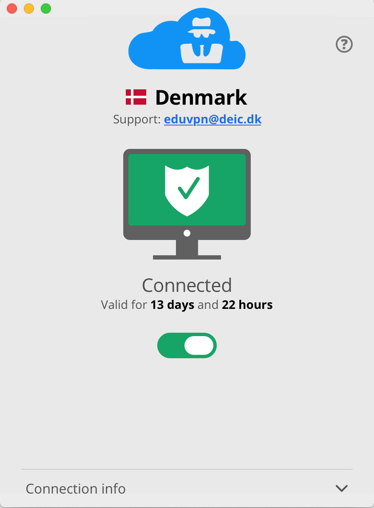

We have been working on GUI improvements for both the VPN server portal as well
as VPN clients. Until now our VPN client GUI did not look the same at all
and the user flow was different per OS.

In the new design, the flows are much more intuitive and simpler. And overall 
the apps and online presence look more "professional".

The new macOS app has been published in the 
[App Store](https://apps.apple.com/app/lets-connect-vpn/id1486810037?mt=12). 
The new Android app has been published in 
[Google Play](https://play.google.com/store/apps/details?id=org.letsconnect_vpn.app)

For Linux the new app can be installed for now by following the steps below. 
For Debian and Ubuntu the instructions are:

    $ sudo apt install build-essential git
    $ git clone https://github.com/eduvpn/python-eduvpn-client.git
    $ cd python-eduvpn-client/
    $ git checkout 2.0.x
    $ sudo make debdev
    $ make lc
